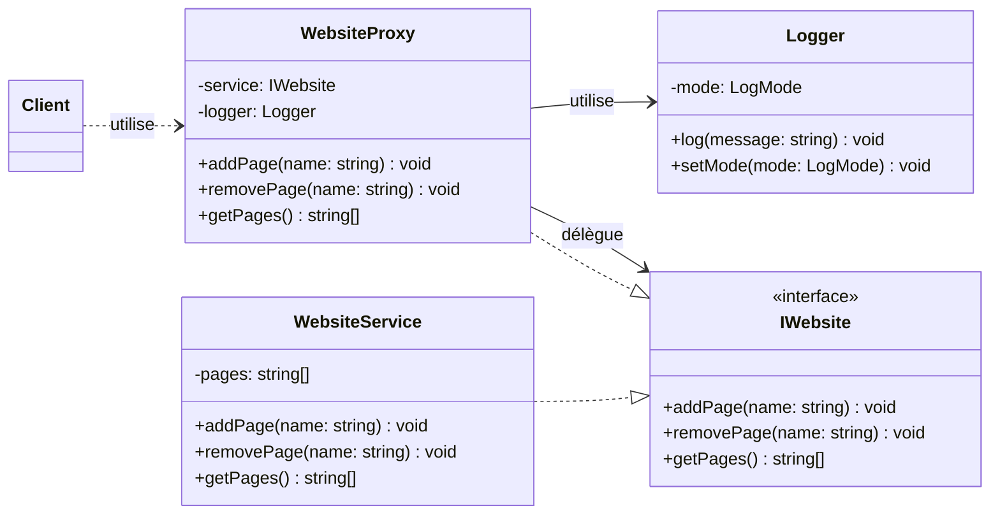

# Diagramme de classes — Proxy Logger

```mermaid
classDiagram
    direction LR

    class Client

    class IWebsite {
        <<interface>>
        +addPage(name: string) void
        +removePage(name: string) void
        +getPages() string[]
    }

    class WebsiteService {
        -pages: string[]
        +addPage(name: string) void
        +removePage(name: string) void
        +getPages() string[]
    }

    class WebsiteProxy {
        -service: IWebsite
        -logger: Logger
        +addPage(name: string) void
        +removePage(name: string) void
        +getPages() string[]
    }

    class Logger {
        -mode: LogMode
        +log(message: string) void
        +setMode(mode: LogMode) void
    }

    %% Le client ne connaît que le proxy, jamais le service réel
    Client ..> WebsiteProxy : utilise

    %% Le proxy intercepte, journalise puis délègue au service
    WebsiteProxy --> Logger : utilise
    WebsiteProxy --> IWebsite : délègue

    %% Le proxy et le service réel partagent la même interface
    WebsiteProxy ..|> IWebsite
    WebsiteService ..|> IWebsite
```
